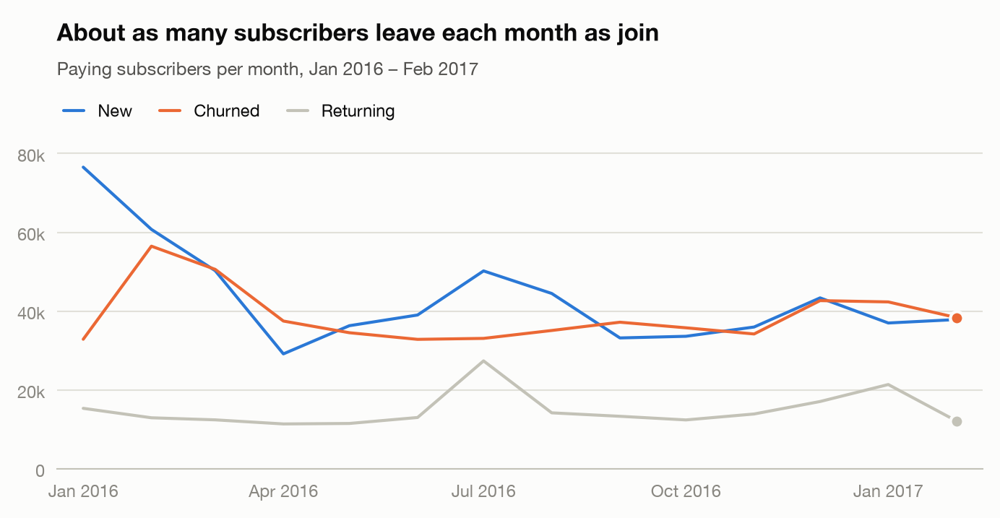
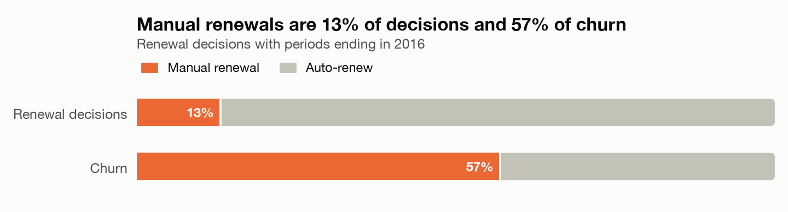
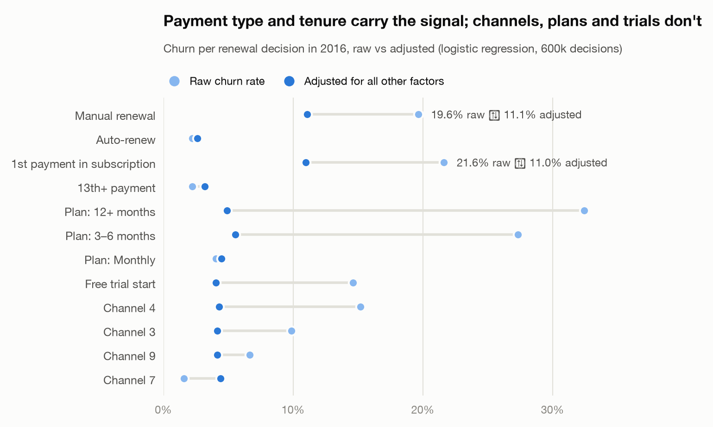
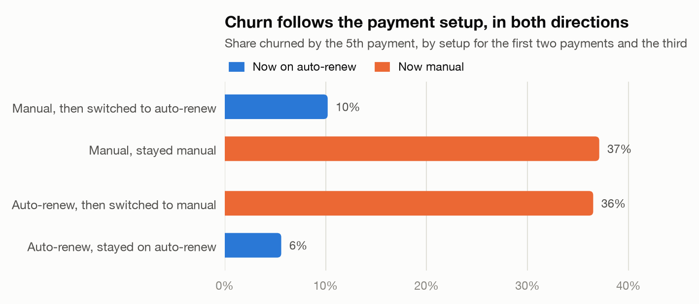

# Who is a music streaming service losing, and what would I change?

*A product analytics case study on 2.4M real subscribers of KKBox, a Taiwanese
music streaming service, 2015–2017.*

**[Open the interactive dashboard](https://azadvoryanskiy.github.io/kkbox-subscription-analytics/)**, filterable by sign-up channel.

## The problem

KKBox grew its paying base by 30% in 14 months, to 1.18M subscribers. But
every month about 3.3% of them leave: 33,000 to 43,000 people, roughly as many
as it signs up. And sign-ups were slowing down. The question a head of product
would ask: which subscribers are we losing, and what should we change?

## The data

23M billing transactions (plans, prices, auto-renew, cancellations), 410M days
of listening logs and 6.8M member records, January 2015 to March 2017. It's
public data from Kaggle's WSDM Cup 2018. It's old, but subscription mechanics
haven't changed.

I didn't take the data on trust. Three things would have broken the analysis:

1. **The "full" transaction file is only half the history.** Transactions that
   expire after 31 March 2017 sit in a second file. With the first file alone,
   8% of apparent churners had actually renewed.
2. **KKBox's own churn label counts a payment, not a membership.** 38% of the
   users it labels as churned were still subscribed, mostly people who renewed
   early onto a longer plan. I defined churn as the membership lapsing for more
   than 30 days instead.
3. **Some "churn" was a billing outage.** Groups of subscribers stopped being
   billed for months, kept listening the whole time, and were then re-billed on
   a single day. 37% of all lapses were billing gaps like this, not churn.

The details and every modelling rule are in the [data notes](data_notes.md).

## What I found

**Churn is mostly about how people pay.** Manual renewals are 13% of renewal
decisions but 57% of churn. Holding everything else fixed, a manual renewal is
more than four times as likely to end in churn as an auto-renewal.

**The first renewal is where new subscribers are lost.** 11% leave at their
first renewal; after that it's 2–5% a month. Manual payers at their first
renewal are 3.5% of all renewal decisions and 28% of all churn.

**Channels, long plans and free trials look bad, but they're the same manual
payers.** Raw churn ranges from 1.6% in one channel to 15% in another. Once
payment type and tenure are accounted for, every channel lands at 4–5%.

**It's the setup, not just the person.** Among subscribers who paid manually
for two months, those who then switched to auto-renew had churned 10% of the
time by their fifth payment; those who stayed manual, 37%. It works in reverse
too, and the switchers weren't the keener listeners.

**Listening is a warning sign, mainly for manual payers.** A manual payer who
didn't listen at all in the four weeks before renewal churns 79% of the time.

## What I'd recommend

**Switch auto-renew on by default at checkout for new subscribers in channels
3, 4 and 9.** Three in four of them pay manually, and 34% of manual payers
leave at their first renewal: about 3,500 subscribers a month.

This isn't a promise of X% lower churn. Part of the gap between manual and
auto-renew payers is who these people are; the test shows how much of it the
setup explains.

Two smaller ideas, to test later: a reminder with one-click renewal for manual
payers who've gone quiet, and offering existing manual payers a switch to
auto-renew.

## How I'd measure it

An A/B test, randomised by user:

- **Primary metric:** churn at the first renewal. Baseline about 27%.
- **Smallest effect worth detecting:** 2 points. That needs about 7,500
  subscribers per group (5% significance, 80% power): roughly a month of
  sign-ups in these channels, plus 45 days until the first renewal outcome is
  known.
- **Guardrails:** checkout conversion (a default can put people off), refunds
  and complaints, cancellations in the first week, and how many people switch
  auto-renew off.
- **Decision rule, agreed before the start:** ship if first-renewal churn drops
  by at least 2 points and checkout conversion doesn't fall by more than a
  threshold set with the product team. Don't read the result early.

## What this data can't tell us

There are no product events, so nothing about specific features; no marketing
spend, so no acquisition cost; and channel and payment-method codes are
anonymised. Everything above except the test is observational.

## The work behind it

- [Interactive dashboard](https://azadvoryanskiy.github.io/kkbox-subscription-analytics/), with the same numbers by sign-up channel
- [Findings](findings.md): the full analysis, question by question
- Notebooks: [subscribers and lifecycle](../notebooks/01_subscribers_and_lifecycle.ipynb),
  [who churns](../notebooks/02_who_churns.ipynb),
  [listening and win-back](../notebooks/03_listening_and_winback.ipynb)
- [Data model](../sql/) in DuckDB SQL, and the [data notes](data_notes.md)
